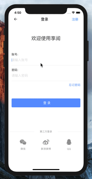
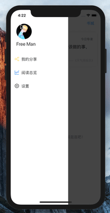
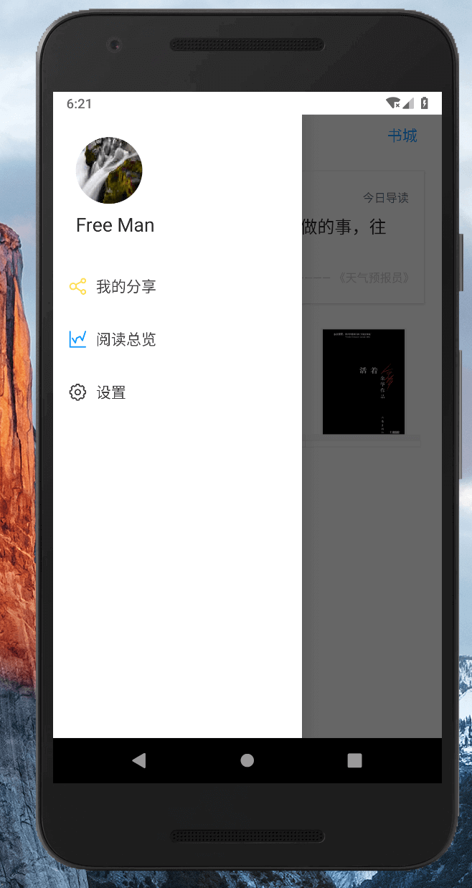
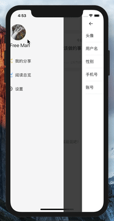
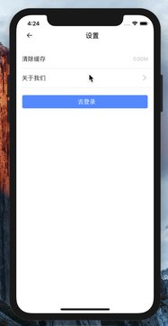
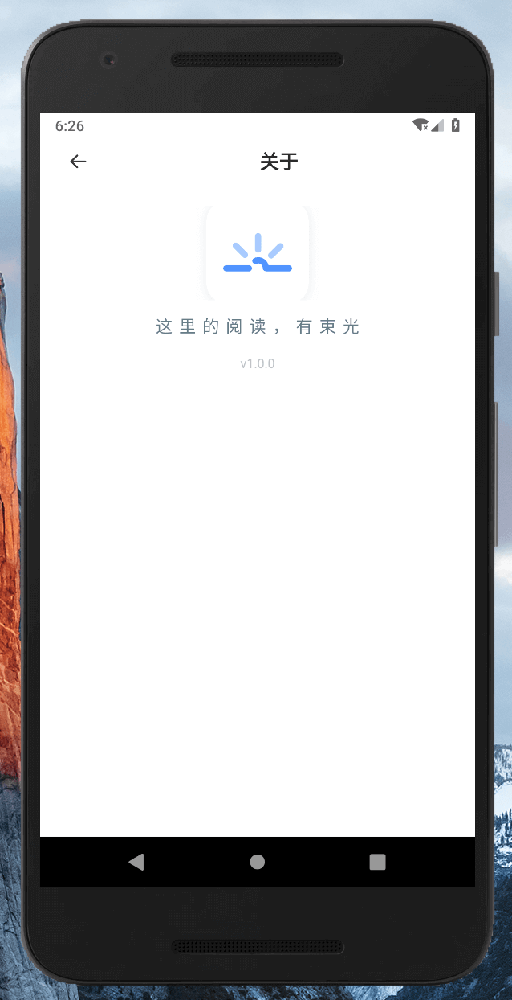
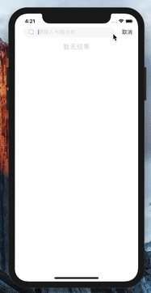

  

  
  
  
  

<h2 align="center"> react-native-share-book </h2>

> 最初写这个项目纯粹就是满足自己读书的要求同时扩展一下知识技能，
> 后来发现周围很多认识的人都有阅读电子书的习惯，无奈大多第三方软件都收费，
> 所以干脆自己好好去写一个以共享为主题的图书，让获取知识的途径更“便捷”。

> 由于“闲余”时间比较有限，加之接触 react 不久，写的也难免会有些仓促...
> 但随着后续深入 react 的过程中，肯定会改进项目中的不足之处。

> 目前项目很多功能只是初版，资源量也不是很大，但是这些都将会利用工作之余慢慢更新迭代。

> 本项目所有接口来源均是利用 [eggjs](https://github.com/eggjs/egg/) 写的一套 node 服务，
> 由于初版使用 js 写的，后期慢慢会用 TS 重构，所以这个项目就不放上来了，[API - 接口文档](https://github.com/cllemon/ReactNativeSharedBook/blob/master/app/assets/public/API.md)。

> 由于服务带宽很小，请不要“疯炸”接口，若有需要数据请直接留言，我会直接放出来。

> 如果对您有帮助，您可以点右上角 "Star" 鼓励一下 谢谢！ ^\_^

## 在线体验

通过下面的二维码，可以在手机中安装体验 React-Native-share-book ( **内测分发密码: 123** )

|         | 二维码                                     | 描述                                                                  |
| ------- | ------------------------------------------ | --------------------------------------------------------------------- |
| Android |  | [ React-Native-share-book (点击下载 apk)](https://www.pgyer.com/YGeu) |
| IOS     | 如果感兴趣，可本地运行                     | 👍                                                                    |

> 注：微信等扫码跳转，在浏览器打开允许下载即可。（ios 体验更好：建议本地运行，获取 ios 证书，本地装。）

## 项目主体

#### 书城页

| instructions                                                                                                                                                 | Preview（IOS）                            | Preview（Android）                                                        |
| ------------------------------------------------------------------------------------------------------------------------------------------------------------ | ----------------------------------------- | ------------------------------------------------------------------------- |
| `书城承载了所有图书资源，主要包含一级分类模块(如：文学、小说等大类)，轮播模块，前期主要放一些图书及公告信息等，猜你喜欢模块，根据用户浏览密度定向推一些书籍` |  |  |

#### 列表页

| instructions                                                                                                                    | Preview（IOS）                           | Preview（Android）                                                     |
| ------------------------------------------------------------------------------------------------------------------------------- | ---------------------------------------- | ---------------------------------------------------------------------- |
| `图书资源列表展示页，主要包含二级分类筛选模块，用于更细粒度的筛选；图书列表模块，展示图书信息，支持下拉/上拉刷新等简单基础功能` |  |  |

#### 详情页

| instructions                                                                                                                                                                     | Preview（IOS）                                | Preview（Android）                                                       |
| -------------------------------------------------------------------------------------------------------------------------------------------------------------------------------- | --------------------------------------------- | ------------------------------------------------------------------------ |
| `主要用于介绍每一本书详细信息，主要包含图书卡片(如：封面，作者，标签等)，图书整体内容简单概要说明文字，作者信息简介，关于图书出版等信息的简单介绍；提供阅读入口，加入书架等操作` |  |  |

#### 阅读器页

| instructions                                                                                                                                          | Preview（IOS）                              | Preview（Android）                                                        |
| ----------------------------------------------------------------------------------------------------------------------------------------------------- | ------------------------------------------- | ------------------------------------------------------------------------- |
| `用于解析资源，阅读的容器，实现基本的目录、定位，阅读进度，换肤、阅读模式切换等基本功能，本APP定位为简单好用即可，故后期也不会去扩展笔记标签等功能。` |  |  |

#### 注册页

| instructions                                                                                                                                                         | Preview（IOS）                             | Preview（Android）                                                         |
| -------------------------------------------------------------------------------------------------------------------------------------------------------------------- | ------------------------------------------ | -------------------------------------------------------------------------- |
| `提供用户注册的页面，生成账户的页面，主要提供四个类目信息，头像（支持相机取照，相册取照）账号，密码，手机号（特别说明：因一些原因，不考虑做手机短信验证和邮箱验证）` |  |  |

#### 登录页

| instructions                                                                                                 | Preview（IOS）                       | Preview（Android）                                                      |
| ------------------------------------------------------------------------------------------------------------ | ------------------------------------ | ----------------------------------------------------------------------- |
| `用于用户登录的页面， 提供找回密码 和注册和第三方登录（目前这个功能隶属迭代功能点，基础版本暂且不上）的入口` |  |  |

#### 我的页

| instructions                                                                                            | Preview（IOS）                         | Preview（Android）                                                     |
| ------------------------------------------------------------------------------------------------------- | -------------------------------------- | ---------------------------------------------------------------------- |
| `主要放一些展示用户信息，设置等将在后期迭代更新的功能点入口（主要是用户阅读历史统计，分享，收藏等...）` |  |  |

#### 个人信息页及书架

| instructions                                                                                                       | Preview（IOS）                               | Preview（Android）                                                         |
| ------------------------------------------------------------------------------------------------------------------ | -------------------------------------------- | -------------------------------------------------------------------------- |
| `主要用于展示用户个人信息，及编辑个人信息特别说明：账号和手机号码是不提供修改的，注册既定。头像和昵称等是可修改的` |  |  |

#### 设置页

| instructions                                                                                               | Preview（IOS）                         | Preview（Android）                                                        |
| ---------------------------------------------------------------------------------------------------------- | -------------------------------------- | ------------------------------------------------------------------------- |
| `主要承载一些基础功能展示，及编辑的功能页面，目前，主要是：清缓存，关于我们这个项目信息，退出登录等的入口` |  |  |

#### 搜索页

| instructions                                                                               | Preview（IOS）                        | Preview（Android）                                                       |
| ------------------------------------------------------------------------------------------ | ------------------------------------- | ------------------------------------------------------------------------ |
| `用于快捷搜索图书，主要检索图书名称, 后期会慢慢加上多字段检索，搜索热度，搜索推荐等功能点` |  |  |

## TODO
**接下来的开发重点**

- 项目整体体验优化
- 代码层面及性能优化（这块得多花点心思，深入一下`react`）
- 持续性的资源整合

**计划中**

- [ ] 用户信息可编辑
- [ ] 书架移除交互 - 由`长按`改为`拖动`移除
- [ ] ...

**已知 Bug**

- [ ] 阅读器界面横向翻页，不流畅。(后期将重构该页面)

## 本地运行

1. [配置 react-native 环境](https://reactnative.cn/docs/getting-started/)

2. 安装 react-native-cli `$ npm i -g react-native-cli`

3. 克隆 react-native-share-book 仓库到本地

4. 安装依赖 `$ yarn || npm i`

5. 打开模拟器

6. 运行项目 `$ npm run android || npm run ios` 或者 `$ yarn android || yarn ios`

> PS：
> 运行 Android 项目时，先打开 Virtual Device 或者[真机调式](https://reactnative.cn/docs/running-on-device/)

## 开发环境及第三方框架

- 开发环境:

  - macOS 10.14.3
  - node "v8.8.0"
  - react-native-cli "2.0.1"
  - Android Studio "3.2"
  - Xcode "10.2.1"

- 第三方框架
  - [react-native(0.58.6)](https://github.com/facebook/react-native)
  - [react-native-image-picker](https://github.com/react-native-community/react-native-image-picker)
  - [react-native-vector-icons](https://github.com/oblador/react-native-vector-icons)
  - [react-native-swiper](https://github.com/react-native-community/react-native-swiper)
  - [react-navigation](https://github.com/react-navigation/react-navigation)
  - [futurepress](https://github.com/futurepress)

## License

[MIT](http://opensource.org/licenses/MIT) License - Copyright (c) 2019 lemon。
